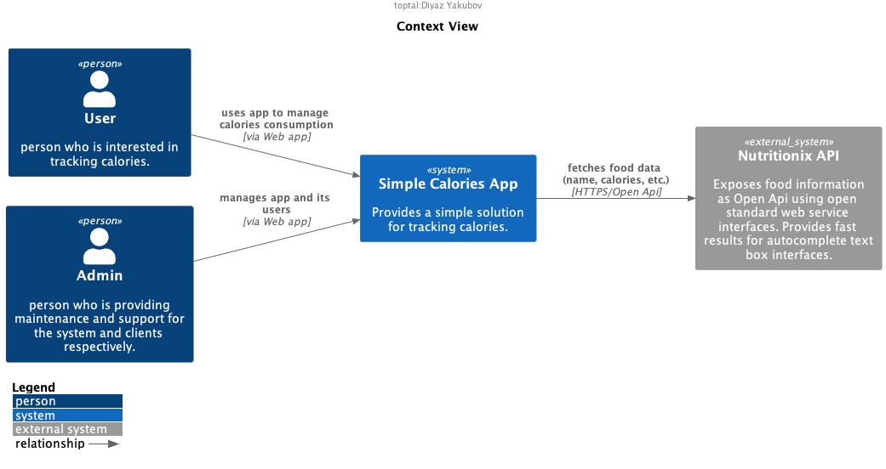
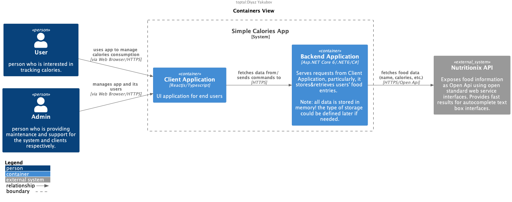

# BIG PICTURE
 The context diagram below illustrates the system and the world around it or context, where the context is its users and external systems.  

   
Audience: business people and technical specialists

# SYSTEM OVERVIEW
The container diagram depicts the system architecture on a container level (container - self deployable application), it also shows how different parts of the system interacts with each other and with external participants.  

   
Audience: technical specialists

# HOW TO RUN FOR DEV
* backend: `cd src/backend;dotnet run` 
  * requires installing .NET SDK
* frontend: `cd src/frontend;npm i;npm start` 
  * requires installing nodejs

# CHANGELOG
* 09.10.2022
  * I have plenty of things to improve in this solution, and I can point at them, describe and provide reasons why I didn't make it.
  * I decided to implement all data filtering on a frontend side though it is not a proper way of fetching and filtering data. The prime reason is that this assignment is focused on a frontend development, but to implement backend pagination and filtering I have to spend some amount of time on backend side, which I consider is not wise for this assignment. 
  * The C4 Model was chosen for visualising the system architecture. It is lightweight and easy to use!
* 06.10.2022
  * Added `hasky` lib to run pre-commit action in order to mitigate the lack of CICD in gitlab. Now tests run every on every commit 💪.
  * For simplicity, many things on the backend side are hardcoded into static classes, meaning that data will be in memory and the server reloading will clean newly added data. (It is not a good practice and may cause memory leaks. On another hand, it shows that I know memory management very well😀.)
* 05.10.2022
  * Apparently, I am not eligible to ran any pipelines and leverage CICD. The `.gitlab-ci.yml` file was renamed to `_gitlab-ci.yml` file to prevent gitlab from running endless empty pipelines.
  * Accidentally, I renamed the default branch from `main` to `1-init` 😅. Decided not to spend much time on trying to rename it back/setting default branch name because I have limited permission though in GitLab with full set of permissions it could be done in a few clicks. From now the default branch is `1-init`. (Probably, I forgot to establish `main` branch(no files were there)).
  * Asp.Net Core framework is selected as the backend framework because it has many features out of the box and very good documentation.
  * ReactJs is selected as a frontend "framework" because it is my preferred lib for frontend development. Additionally, Material UI library was chosen for fast flow development because it provides a good set of components which are already styled. 
  